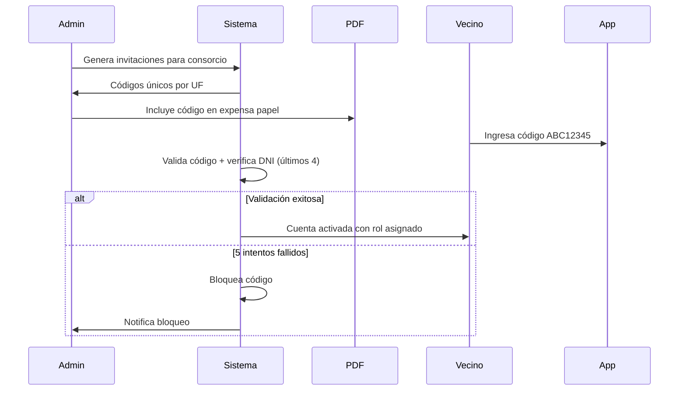
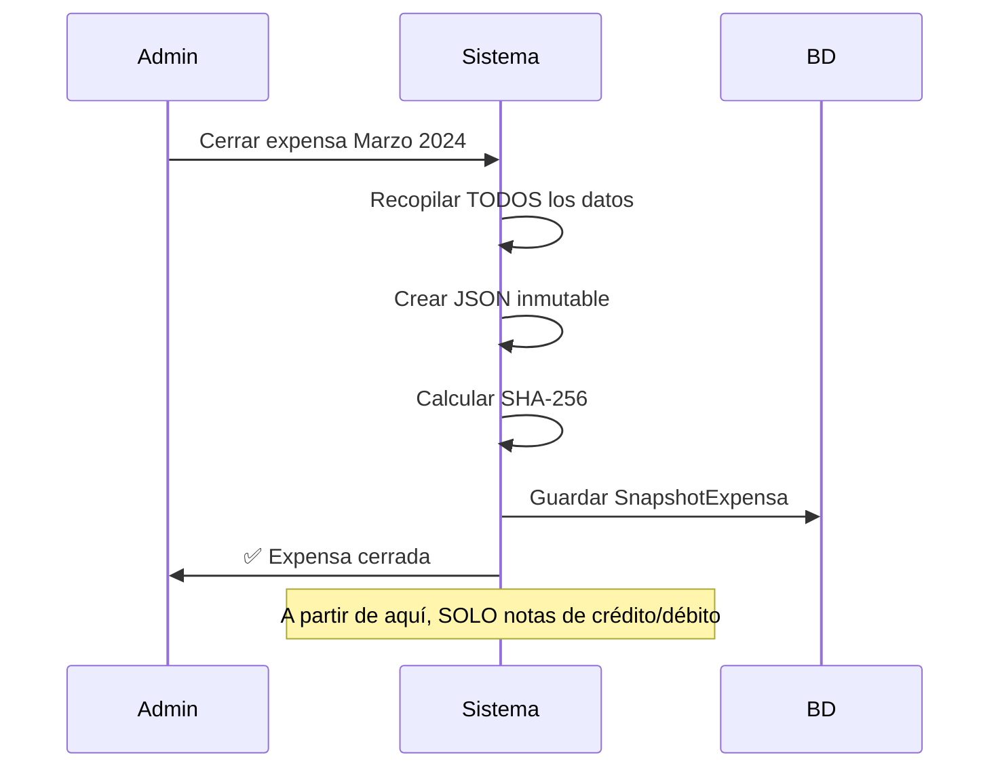
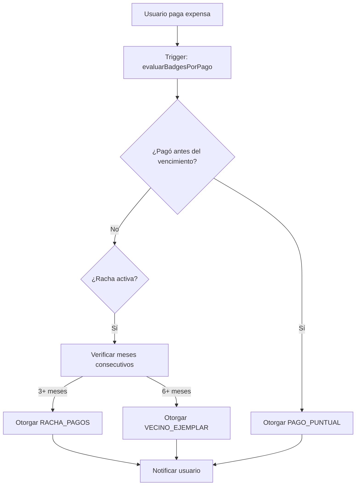

# Funcionalidades Críticas - VecinoSimple

Este documento describe las 6 funcionalidades críticas agregadas al sistema para abordar puntos ciegos identificados en el análisis del proyecto.

---

## 1. 🔐 Sistema KYC (Know Your Customer) / Claiming de Unidades

### Problema Resuelto
Sin validación de identidad, cualquiera podría registrarse diciendo "Soy el dueño del 4B" y acceder a información financiera sensible.

### Solución Implementada
Sistema de **código único de invitación** impreso en las expensas papel:

```
┌─────────────────────────────────────────────────────┐
│              EXPENSA FEBRERO 2024                   │
│              CONSORCIO EDIFICIO SOL                 │
│─────────────────────────────────────────────────────│
│  Unidad: 4B                                         │
│  Total a Pagar: $85.000                             │
│                                                     │
│  ┌───────────────────────────────────────────────┐  │
│  │  ACTIVÁ TU CUENTA DIGITAL                     │  │
│  │  Código: ABC12345                             │  │
│  │  Escaneá el QR o ingresá en                   │  │
│  │  app.vecinosimple.com/activar                 │  │
│  └───────────────────────────────────────────────┘  │
└─────────────────────────────────────────────────────┘
```

### Flujo de Claiming



### Endpoints API

| Método | Endpoint | Descripción |
|--------|----------|-------------|
| `POST` | `/claiming/invitaciones` | Admin crea invitación |
| `POST` | `/claiming/invitaciones/bulk` | Admin crea masivamente |
| `POST` | `/claiming/validar-codigo` | Pre-valida sin consumir |
| `POST` | `/claiming/reclamar` | Usuario reclama con código |
| `PATCH` | `/claiming/invitaciones/:id/revocar` | Revoca invitación |
| `PATCH` | `/claiming/invitaciones/:id/regenerar-codigo` | Nuevo código |

### Modelo de Datos

```typescript
InvitacionUnidad {
  id: string
  consorcioId: string
  unidadFuncionalId: string
  codigoInvitacion: string      // ABC12345 (único)
  rolAsignado: Rol              // PROPIETARIO, INQUILINO
  tipoVinculo: TipoVinculoUF    // TITULAR_VOTANTE, COPROPIETARIO
  dniEsperado?: string          // Últimos 4 dígitos para verificar
  estado: EstadoInvitacion      // PENDIENTE, ACEPTADA, EXPIRADA, REVOCADA
  fechaExpiracion: Date         // 90 días por defecto
  intentosFallidos: number      // Máx 5 antes de bloquear
}
```

---

## 2. ⚖️ Reglas de Fair Use para Amenities

### Problema Resuelto
- El vecino del 8A reserva el SUM todos los sábados
- Usuarios reservan y no asisten (no-show)
- Cancelaciones de último minuto

### Solución Implementada
Sistema de **reglas configurables por amenity** con penalizaciones automáticas.

### Tipos de Reglas Soportadas

| Tipo | Ejemplo de Configuración |
|------|-------------------------|
| `limite_periodo` | `{ maxReservas: 2, periodo: "mes", diasSemana: [6, 0] }` |
| `penalizacion` | `{ horasAnticipacion: 24, montoMulta: 5000, bloquearDias: 30 }` |
| `bloqueo` | `{ motivosBloqueo: ["no_show"], diasBloqueo: 60 }` |
| `horario` | `{ horaInicio: "08:00", horaFin: "22:00", diasPermitidos: [1,2,3,4,5] }` |

### Modelo de Datos

```typescript
ReglaReservaAmenity {
  id: string
  consorcioId: string
  amenityId: string
  nombre: string           // "Límite fin de semana"
  tipoRegla: string        // "limite_periodo", "penalizacion", etc.
  configuracion: JSON      // Flexible según tipo
  prioridad: number        // Orden de evaluación
  activa: boolean
}

PenalizacionReserva {
  id: string
  usuarioId: string
  reservaId: string
  tipo: string             // "multa", "bloqueo_temporal", "advertencia"
  motivo: string           // "Cancelación tardía", "No show"
  montoMulta?: Decimal
  diasBloqueo?: number
  fechaFinBloqueo?: Date
  aplicadoEnExpensa?: string
}
```

---

## 3. 🚨 Alertas de Emergencia Multicanal

### Problema Resuelto
Si se rompe un caño a las 3 AM, un email no sirve. Necesitamos despertar a los vecinos.

### Solución Implementada
Sistema de **alertas críticas** que disparan notificaciones en **todos los canales simultáneamente**.

### Canales de Notificación

```
┌─────────────────────────────────────────────────────────────┐
│                    ALERTA DE EMERGENCIA                     │
│                    Tipo: CORTE_GAS 🔥                        │
├─────────────────────────────────────────────────────────────┤
│                                                             │
│    ┌─────────┐   ┌─────────┐   ┌──────────┐   ┌─────────┐  │
│    │  PUSH   │   │  EMAIL  │   │ WHATSAPP │   │   SMS   │  │
│    │    📱   │   │    📧   │   │    💬    │   │   📟   │  │
│    └────┬────┘   └────┬────┘   └─────┬────┘   └────┬────┘  │
│         │             │              │             │        │
│         └─────────────┴──────────────┴─────────────┘        │
│                          │                                  │
│                          ▼                                  │
│                   Todos los vecinos                         │
└─────────────────────────────────────────────────────────────┘
```

### Tipos de Emergencia

| Tipo | Icono | Color | Descripción |
|------|-------|-------|-------------|
| `CORTE_AGUA` | 💧 | #2196F3 | Corte de suministro de agua |
| `CORTE_GAS` | 🔥 | #FF5722 | Fuga o corte de gas |
| `CORTE_LUZ` | ⚡ | #FFC107 | Corte de energía eléctrica |
| `INCENDIO` | 🔥 | #F44336 | Situación de incendio |
| `EVACUACION` | 🚪 | #F44336 | Evacuación del edificio |
| `SEGURIDAD` | 🚨 | #9C27B0 | Alerta de seguridad |
| `OTRO` | ⚠️ | #607D8B | Otra emergencia |

### Endpoints API

| Método | Endpoint | Descripción |
|--------|----------|-------------|
| `POST` | `/alertas` | Crear alerta (dispara notificaciones) |
| `PATCH` | `/alertas/:id/resolver` | Marcar como resuelta |
| `GET` | `/alertas/consorcio/:id/activas` | Emergencias activas |

---

## 4. 📜 Snapshots Inmutables de Expensas (Backup Legal)

### Problema Resuelto
En un juicio por deuda, necesitamos probar **cómo se compuso la deuda mes a mes**. Si el sistema permite editar expensas cerradas, perdemos valor probatorio.

### Solución Implementada
**Inmutabilidad total** de expensas cerradas con hash SHA-256 para verificación de integridad.

### Flujo de Cierre



### Estructura del Snapshot

```typescript
interface ExpensaSnapshotData {
  periodo: string
  consorcio: {
    id: string
    nombre: string
    direccion: string
    cuit?: string
  }
  totales: {
    gastosOrdinarios: number
    gastosExtraordinarios: number
    ingresos: number
    fondoReserva: number
  }
  gastos: Array<{
    id: string
    concepto: string
    monto: number
    fechaGasto: Date
    proveedor?: string
    comprobante?: string
  }>
  detallesPorUnidad: Array<{
    unidadFuncionalId: string
    codigo: string
    coeficiente: number
    montoOrdinario: number
    montoExtraordinario: number
    saldoAnterior: number
    intereses: number
    total: number
  }>
  fechaCierre: Date
  hashIntegridad: string  // SHA-256
}
```

### Verificación de Integridad

```bash
GET /snapshots/:id/verificar-integridad

{
  "esValido": true,
  "hashAlmacenado": "a1b2c3...",
  "hashCalculado": "a1b2c3...",
  "fechaVerificacion": "2024-02-15T10:30:00Z"
}
```

### Notas de Crédito/Débito

La **única forma** de ajustar montos después del cierre:

```typescript
POST /snapshots/notas
{
  "snapshotExpensaId": "snapshot_123",
  "unidadFuncionalId": "uf_456",
  "tipo": "credito",
  "monto": 5000,
  "concepto": "Error en cálculo de intereses",
  "justificacion": "Se cobró interés doble por error del sistema...",
  "aplicadoEnPeriodo": "2024-03"
}
```

---

## 5. 🏆 Sistema de Gamificación (Badges)

### Problema Resuelto
La gente odia pagar expensas. Solo entran a la app para ver malas noticias.

### Solución Implementada
Sistema de **badges/logros** que premia el buen comportamiento con beneficios tangibles.

### Badges Disponibles

| Badge | Icono | Criterio | Beneficio Ejemplo |
|-------|-------|----------|-------------------|
| **Vecino Puntual** | ⏰ | Pagó antes del vencimiento | - |
| **Racha de Pagos** | 🔥 | 3+ meses consecutivos al día | - |
| **Vecino Ejemplar** | ⭐ | 6 meses al día | 5% descuento próxima expensa |
| **Participativo** | 🗳️ | Asiste a 3+ asambleas | Reserva prioritaria amenities |
| **Colaborador** | 🛠️ | 5+ reportes útiles | - |

### Flujo de Evaluación Automática



### Endpoints API

| Método | Endpoint | Descripción |
|--------|----------|-------------|
| `GET` | `/badges/mis-badges/:consorcioId` | Resumen con progreso |
| `GET` | `/badges/usuario/:id/publicos` | Badges visibles de otro |
| `POST` | `/badges/evaluar` | Evaluar y otorgar (admin) |
| `POST` | `/badges/:id/usar-beneficio` | Canjear beneficio |

---

## 6. 📱 QR Tracking (Migración Papel → Digital)

### Problema Resuelto
No todos los abuelos usarán la app el día 1. Necesitamos un puente entre el papel y lo digital.

### Solución Implementada
Cada expensa PDF incluye un **QR gigante con tracking**:

```
┌─────────────────────────────────────────────────────┐
│                                                     │
│     ┌───────────────────┐                           │
│     │ ▄▄▄▄▄ ▄ ▄▄▄ ▄▄▄▄▄│  ESCANEÁ PARA:            │
│     │ █   █ █▄█ █ █   █│  • Pagar esta expensa     │
│     │ █▄▄▄█ ▄█▄▄▄ █▄▄▄█│  • Ver detalle de gastos  │
│     │ ▄▄▄▄▄ ▄▄█▄█ ▄ ▄▄▄│  • Activar tu cuenta      │
│     │ █   █ █ ▄█▄ █▄█▄▄│                           │
│     │ █▄▄▄█ █ ▄▄▄▄▄ ▄▄▄│  app.vecinosimple.com    │
│     └───────────────────┘                           │
│                                                     │
└─────────────────────────────────────────────────────┘
```

### Modelo de Datos

```typescript
QRExpensaTracking {
  id: string
  codigoQR: string              // Único por QR
  expensaPeriodo: string        // "2024-02"
  unidadFuncionalId: string
  consorcioId: string
  accion: string                // "pagar", "ver_detalle", "descargar_pdf"
  urlDestino: string            // URL completa
  escaneos: number              // Contador
  primerEscaneo?: Date
  ultimoEscaneo?: Date
  convertido: boolean           // ¿Completó la acción?
  conversionAt?: Date
}
```

### Métricas de Conversión

```bash
GET /qr-tracking/metricas/:consorcioId

{
  "totalQRGenerados": 150,
  "totalEscaneos": 89,
  "tasaEscaneo": "59.3%",
  "conversiones": 42,
  "tasaConversion": "47.2%",
  "accionesPorTipo": {
    "pagar": 35,
    "ver_detalle": 4,
    "activar_cuenta": 3
  }
}
```

---

## Resumen de Módulos Implementados

| Módulo | Endpoints | Descripción | Estado |
|--------|-----------|-------------|--------|
| `ClaimingModule` | 7 | KYC / Validación de identidad | ✅ Completo |
| `AlertasModule` | 5 | Emergencias multicanal | ✅ Completo |
| `SnapshotsModule` | 7 | Inmutabilidad legal | ✅ Completo |
| `BadgesModule` | 9 | Gamificación | ✅ Completo |
| `QRTrackingModule` | 3 | Tracking QR expensas | ✅ Completo |
| `AmenityRulesModule` | CRUD | Reglas fair use | ✅ Completo |
| `ExpensasModule` | 7 | Motor de liquidación | ✅ Completo |
| `GastosModule` | 9 | Gestión de gastos | ✅ Completo |
| `PagosModule` | 7 | Pagos + MP Webhook | ✅ Completo |
| `AuditModule` | Global | Log inmutable | ✅ Completo |

### Próximos Pasos

1. **TicketsModule** - Sistema de reclamos y mantenimiento
2. **ComunicadosModule** - Novedades del edificio
3. **NotificacionesModule** - Centro de notificaciones
4. **Integración WhatsApp** - Conectar con WhatsApp Business API
5. **Tests E2E** - Validar flujos completos
6. **Frontend** - Implementar pantallas en admin-web y resident-app
