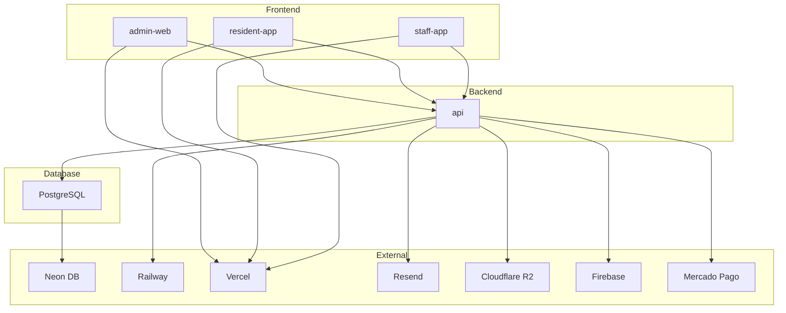
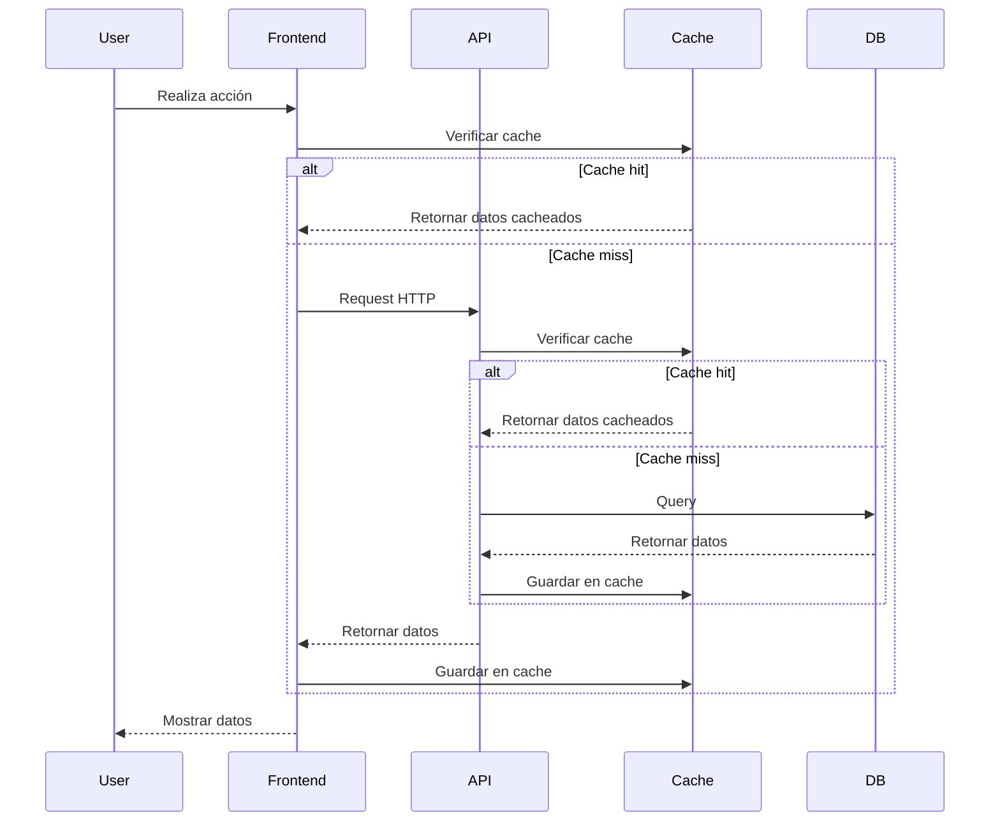
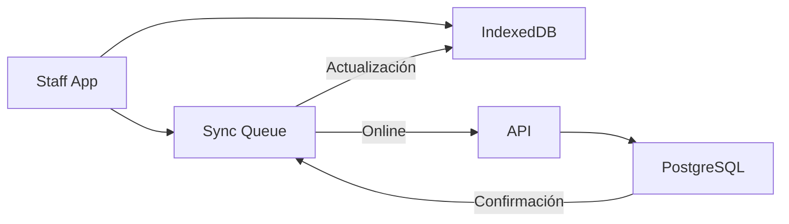

# 🔍 Auditoría de Arquitectura - VecinoSimple

> **Fecha:** 26 de Enero 2026  
> **Auditor:** Architect Mode  
> **Versión del Sistema:** 1.0.0  
> **Alcance:** Monorepo completo (Apps + Packages + Infraestructura)

---

## 📋 Resumen Ejecutivo

Se realizó una auditoría exhaustiva de la arquitectura del proyecto VecinoSimple, un monorepo para la administración de consorcios con múltiples aplicaciones y packages compartidos. La auditoría cubrió:

- Monorepo y Workspaces
- Arquitectura de Apps (admin-web, api, resident-app, staff-app)
- Arquitectura de Packages (database, ui, business-logic)
- Comunicación entre Apps
- Escalabilidad y Rendimiento
- Mantenibilidad
- Patrones de Diseño

### Veredicto General: ✅ **ARQUITECTURA SÓLIDA con áreas de mejora**

El sistema presenta una arquitectura **bien estructurada** con buenas prácticas de monorepo, separación de concerns apropiada, y patrones de diseño sólidos. Se identificaron oportunidades de mejora en escalabilidad, consistencia y algunas áreas técnicas.

---

## 1. MONOREPO Y WORKSPACES

### 1.1 Evaluación de Estructura

| Aspecto | Estado | Observaciones |
|----------|--------|--------------|
| **Herramienta** | ✅ Turborepo | Elección adecuada para el scope (3 apps + packages) |
| **Gestor de Paquetes** | ✅ pnpm | Eficiente, ahorra espacio en disco |
| **Configuración** | ✅ Correcta | `pnpm-workspace.yaml` bien configurado |
| **Separación Apps/Packages** | ✅ Clara | Distinción clara entre aplicaciones y código compartido |

**Estructura del Monorepo:**
```
vecinosimple/
├── apps/
│   ├── admin-web/          # Next.js - Portal Administradores
│   ├── api/                # NestJS - Backend API
│   ├── resident-app/       # Next.js PWA - App Vecinos
│   └── staff-app/          # Next.js PWA - App Encargados (Offline-First)
├── packages/
│   ├── database/           # Prisma Schema + Client
│   ├── ui/                 # Design System (Radix + Tailwind)
│   ├── business-logic/     # Calculators + Validators
│   ├── eslint-config/      # ESLint compartido
│   ├── typescript-config/   # TS configs compartidos
│   └── tailwind-config/    # Tailwind config compartido
├── turbo.json
├── pnpm-workspace.yaml
└── package.json
```

### 1.2 Configuración de Turbo

**[`turbo.json`](turbo.json:1) - Análisis:**

```json
{
  "tasks": {
    "build": {
      "dependsOn": ["^build"],
      "outputs": [".next/**", "!.next/cache/**", "dist/**"]
    },
    "dev": {
      "cache": false,
      "persistent": true
    }
  }
}
```

**✅ Fortalezas:**
- Configuración de dependencias de build correcta (`^build`)
- Outputs bien definidos para caching
- Tarea `dev` configurada como persistente

**⚠️ Áreas de Mejora:**
- No hay configuración de `pipeline` para optimizar el orden de ejecución
- Falta configuración de `env` específico por tarea

**Recomendación:**
```json
{
  "pipeline": {
    "build": {
      "dependsOn": ["^build"],
      "outputs": [".next/**", "!.next/cache/**", "dist/**"]
    },
    "db:generate": {
      "dependsOn": ["^build"],
      "outputs": ["node_modules/.prisma/**"]
    },
    "lint": {
      "outputs": []
    },
    "test": {
      "dependsOn": ["build"],
      "outputs": ["coverage/**"]
    }
  }
}
```

### 1.3 Separación de Concerns

**✅ Fortalezas:**
- **Apps** contienen lógica específica de cada aplicación
- **Packages** contienen código compartido reutilizable
- **Config packages** centralizan configuraciones (ESLint, TS, Tailwind)

**⚠️ Áreas de Mejora:**
- El package `@vecinosimple/ui` contiene componentes que podrían ser más específicos por app
- No hay un package `@vecinosimple/api-client` compartido (cada app tiene su propio `api-client.ts`)

**Recomendación:**
Crear un package `@vecinosimple/api-client` compartido:
```
packages/api-client/
├── src/
│   ├── client.ts          # Cliente base con autenticación
│   ├── endpoints/         # Endpoints tipados
│   └── index.ts
└── package.json
```

### 1.4 Configuración de Despliegue

**[`vercel.json`](vercel.json:1) - Análisis:**

```json
{
  "installCommand": "pnpm install --frozen-lockfile",
  "buildCommand": "pnpm run build"
}
```

**⚠️ Problema Identificado:**
Este archivo está en la raíz pero cada app debería tener su propia configuración para despliegue independiente.

**Recomendación:**
Mantener `vercel.json` en la raíz para configuración global, pero cada app puede tener overrides específicos si es necesario.

---

## 2. ARQUITECTURA DE APPS

### 2.1 admin-web (Next.js)

**[`apps/admin-web/package.json`](apps/admin-web/package.json:1) - Análisis:**

**Tecnologías:**
- Next.js 14.1.0 con App Router
- React 18.2.0
- TanStack Query 5.17.0 (gestión de estado del servidor)
- Zustand 4.5.0 (gestión de estado del cliente)
- Radix UI + Tailwind CSS (UI)
- React Hook Form + Zod (formularios y validación)

**✅ Fortalezas:**
- Stack moderno y bien mantenido
- Uso de App Router (Next.js 14+)
- Separación clara de features en [`apps/admin-web/src/features/`](apps/admin-web/src/features)
- Implementación de hooks personalizados por feature
- Configuración de testing con Vitest y Playwright

**⚠️ Áreas de Mejora:**
- El `api-client.ts` está duplicado en cada app (debería ser un package compartido)
- No hay implementación de Service Workers para PWA (solo resident-app y staff-app tienen `next-pwa`)
- Falta configuración de i18n para soporte multi-idioma

**Estructura de Directorios:**
```
apps/admin-web/src/
├── app/                    # Next.js App Router
│   ├── (auth)/            # Grupo de rutas de autenticación
│   ├── (dashboard)/       # Grupo de rutas del dashboard
│   ├── error.tsx
│   ├── layout.tsx
│   └── page.tsx
├── features/               # Feature-based architecture
│   ├── alertas/
│   ├── amenities/
│   ├── asambleas/
│   ├── comunicados/
│   ├── consorcios/
│   ├── documentos/
│   ├── expensas/
│   ├── gastos/
│   ├── pagos/
│   ├── proveedores/
│   ├── tickets/
│   └── usuarios/
├── lib/
│   ├── api-client.ts       # Cliente HTTP personalizado
│   ├── query-provider.tsx  # Provider de TanStack Query
│   └── utils.ts
└── ui/                     # UI components específicos de admin-web
    ├── components/
    └── layouts/
```

**Patrones de Diseño Identificados:**
- ✅ **Feature-based architecture**: Cada feature tiene su propio directorio
- ✅ **Custom hooks**: `useExpensas`, `useGastos`, etc. para encapsular lógica
- ✅ **Separation of concerns**: UI, lógica de negocio, y datos están separados
- ✅ **Type-safe API**: Uso de TypeScript en todo el código

### 2.2 api (NestJS)

**[`apps/api/src/app.module.ts`](apps/api/src/app.module.ts:1) - Análisis:**

**Tecnologías:**
- NestJS 10.3.0
- Prisma ORM 5.8.0
- JWT Authentication
- Class-validator + Class-transformer
- Swagger/OpenAPI

**✅ Fortalezas:**
- Arquitectura modular bien organizada
- Implementación de Guards para autorización
- Rate limiting global configurado con ThrottlerModule
- Validación de DTOs con class-validator
- Documentación automática con Swagger
- Helmet configurado para headers de seguridad

**⚠️ Áreas de Mejora:**
- No hay implementación de Redis para caching distribuido
- No hay implementación de WebSockets para real-time (aunque está documentado en ARCH-004)
- Falta implementación de circuit breakers para tolerancia a fallos
- No hay implementación de message queue para tareas asíncronas

**Estructura de Directorios:**
```
apps/api/src/
├── modules/                # Módulos funcionales
│   ├── alertas/
│   ├── amenities/
│   ├── amenities-rules/
│   ├── asambleas/
│   ├── auth/
│   ├── badges/
│   ├── claiming/
│   ├── comunicados/
│   ├── consorcios/
│   ├── documentos/
│   ├── email/
│   ├── expensas/
│   ├── gastos/
│   ├── notificaciones/
│   ├── pagos/
│   ├── pdf/
│   ├── proveedores/
│   ├── push/
│   ├── qr-tracking/
│   ├── resident-portal/
│   ├── snapshots/
│   ├── storage/
│   ├── tickets/
│   ├── unidades-funcionales/
│   ├── usuarios/
│   └── whatsapp/
├── common/                 # Código compartido
│   ├── decorators/         # @CurrentUser, @Roles
│   ├── guards/             # RolesGuard, JwtAuthGuard
│   ├── interfaces/         # RequestWithUser
│   └── utils/              # Sanitizer
└── database/
    ├── database.module.ts
    └── prisma.service.ts
```

**Patrones de Diseño Identificados:**
- ✅ **Modular architecture**: Cada módulo es autocontenido
- ✅ **Dependency Injection**: Uso de DI de NestJS
- ✅ **Guard pattern**: Guards para autorización
- ✅ **Decorator pattern**: Decoradores personalizados
- ✅ **Repository pattern**: Prisma actúa como repository
- ✅ **DTO pattern**: Data Transfer Objects para validación

**Seguridad Implementada:**
- ✅ Helmet para headers de seguridad
- ✅ Rate limiting global (10 req/seg, 50 req/10seg, 200 req/min)
- ✅ CORS configurado por entorno
- ✅ JWT con validación completa
- ✅ ValidationPipe con whitelist
- ✅ Sanitización XSS

### 2.3 resident-app (Next.js PWA)

**[`apps/resident-app/package.json`](apps/resident-app/package.json:1) - Análisis:**

**Tecnologías:**
- Next.js 14.1.0
- next-pwa 5.6.0
- TanStack Query 5.17.0
- Zustand 4.5.0

**✅ Fortalezas:**
- Configuración de PWA con next-pwa
- Stack consistente con admin-web
- Uso de TanStack Query para caching

**⚠️ Áreas de Mejora:**
- No hay implementación offline-first (solo staff-app tiene esto)
- Falta implementación de Service Workers personalizados
- No hay implementación de push notifications (aunque está en el package.json de la API)

**Estructura de Directorios:**
```
apps/resident-app/src/
├── app/                    # Next.js App Router
│   ├── app/               # Rutas protegidas
│   ├── mantenimiento/      # Página de mantenimiento
│   ├── offline/            # Página offline
│   ├── error.tsx
│   └── layout.tsx
└── (más estructura similar a admin-web)
```

### 2.4 staff-app (Next.js PWA Offline-First)

**[`apps/staff-app/package.json`](apps/stident-app/package.json:1) - Análisis:**

**Tecnologías:**
- Next.js 14.1.0
- next-pwa 5.6.0
- Dexie.js 3.2.4 (IndexedDB wrapper)
- Dexie React Hooks 1.1.7
- TanStack Query 5.17.0

**✅ Fortalezas:**
- Implementación completa de offline-first
- Uso de Dexie.js para IndexedDB
- Sync Manager para sincronización en segundo plano
- Páginas de mantenimiento y offline

**⚠️ Áreas de Mejora:**
- El Sync Manager no maneja conflictos de datos (solo "Last Write Wins")
- No hay implementación de cola de sincronización con prioridades
- Falta implementación de reintentos con backoff exponencial

**Implementación Offline-First:**

**[`apps/staff-app/src/offline/db.ts`](apps/staff-app/src/offline/db.ts:1):**
```typescript
class VecinoSimpleStaffDB extends Dexie {
  bitacora!: Table<BitacoraLocal, string>;
  paquetes!: Table<PaqueteLocal, string>;
  rondas!: Table<RondaLocal, string>;

  constructor() {
    super("vecinosimple-staff");
    this.version(1).stores({
      bitacora: "localId, syncStatus, timestamp",
      paquetes: "localId, syncStatus, destinatarioUF",
      rondas: "localId, syncStatus, inicioAt",
    });
  }
}
```

**[`apps/staff-app/src/offline/sync-manager.ts`](apps/staff-app/src/offline/sync-manager.ts:1):**
```typescript
class SyncManager {
  private isSyncing = false;
  private syncInterval: NodeJS.Timeout | null = null;

  async syncAll(): Promise<SyncResult> {
    // Sincroniza bitácora, paquetes y rondas
  }
}
```

**Patrones de Diseño Identificados:**
- ✅ **Offline-First pattern**: Datos disponibles offline
- ✅ **Sync pattern**: Sincronización automática cuando hay conexión
- ✅ **Singleton pattern**: SyncManager como singleton
- ✅ **Repository pattern**: Dexie como repository local

---

## 3. ARQUITECTURA DE PACKAGES

### 3.1 database (Prisma)

**[`packages/database/package.json`](packages/database/package.json:1) - Análisis:**

**Tecnologías:**
- Prisma ORM 5.10.0
- PostgreSQL

**✅ Fortalezas:**
- Schema de Prisma bien estructurado
- Separación clara de modelos por funcionalidad
- Uso de enums para tipos definidos
- Índices bien definidos
- Documentación inline en el schema

**⚠️ Áreas de Mejora:**
- No hay implementación de migrations en el package (solo seed)
- Falta implementación de soft delete global
- No hay implementación de audit trail automático (aunque existe el modelo AuditLog)

**Schema de Prisma - Análisis:**

**[`packages/database/prisma/schema.prisma`](packages/database/prisma/schema.prisma:1) - 1415 líneas:**

**Modelos Principales:**
- `Organizacion` - Agrupa múltiples consorcios
- `Consorcio` - Representa un edificio/consorcio
- `Usuario` - Usuario del sistema
- `UsuarioConsorcio` - Relación Usuario-Consorcio con rol
- `UnidadFuncional` - Departamento, cochera, baulera, etc.

**Modelos Financieros:**
- `Expensa` - Liquidación mensual
- `DetalleExpensa` - Detalle por UF
- `Gasto` - Gasto individual
- `MovimientoCuentaCorriente` - Cuenta corriente del vecino
- `Pago` - Pagos realizados

**Modelos de Funcionalidades Extendidas:**
- `InvitacionUnidad` - Sistema KYC/Claiming
- `ReglaReservaAmenity` - Reglas de amenities
- `PenalizacionReserva` - Penalizaciones
- `AlertaEmergencia` - Alertas multicanal
- `SnapshotExpensa` - Snapshots inmutables
- `NotaCreditoDebito` - Notas sobre snapshots
- `BadgeDefinicion` - Definición de badges
- `BadgeUsuario` - Badges obtenidos
- `QRExpensaTracking` - Tracking QR

**Modelos Offline-First:**
- `SyncQueue` - Cola de sincronización
- `BitacoraSeguridad` - Bitácora del encargado
- `RecepcionPaquete` - Registro de paquetería

**Patrones de Diseño Identificados:**
- ✅ **Multi-tenancy pattern**: `consorcioId` en todas las queries
- ✅ **Audit trail pattern**: `AuditLog` inmutable
- ✅ **Soft delete pattern**: Campos `activo` en modelos
- ✅ **Immutable snapshot pattern**: `SnapshotExpensa` inmutable
- ✅ **Enum pattern**: Uso de enums para tipos definidos

### 3.2 ui (Design System)

**[`packages/ui/package.json`](packages/ui/package.json:1) - Análisis:**

**Tecnologías:**
- Radix UI (componentes accesibles)
- Tailwind CSS
- Class Variance Authority (CVA)
- Zustand (para stores de UI)

**✅ Fortalezas:**
- Componentes accesibles (Radix UI)
- Uso de CVA para variantes de componentes
- Separación clara de primitives, patterns y layouts
- Storybook configurado para documentación

**⚠️ Áreas de Mejora:**
- No hay implementación de theming completo (solo hay `theme-provider.tsx`)
- Falta implementación de dark mode completo
- No hay implementación de componentes de internacionalización

**Estructura de Directorios:**
```
packages/ui/src/
├── components/
│   ├── layouts/           # DashboardLayout, SimpleLayout
│   ├── patterns/          # ExpensaCard, StatCard, etc.
│   └── primitives/        # Button, Input, Card, etc.
├── hooks/
│   └── use-toast.ts
├── lib/
│   └── utils.ts
└── stores/
    └── ui.store.ts
```

**Patrones de Diseño Identificados:**
- ✅ **Atomic design**: Primitives → Patterns → Layouts
- ✅ **Compound components**: Componentes compuestos
- ✅ **Store pattern**: Zustand para estado global de UI
- ✅ **Hook pattern**: Custom hooks para lógica reutilizable

### 3.3 business-logic

**[`packages/business-logic/package.json`](packages/business-logic/package.json:1) - Análisis:**

**Tecnologías:**
- Zod 3.22.4 (validación)

**✅ Fortalezas:**
- Separación clara de calculators, validators y constants
- Uso de Zod para validación
- Lógica de negocio compartida entre apps

**⚠️ Áreas de Mejora:**
- No hay implementación de tests unitarios
- Falta implementación de más calculators (solo hay expensa e interes)
- No hay implementación de servicios de negocio complejos

**Estructura de Directorios:**
```
packages/business-logic/src/
├── calculators/
│   ├── expensa.calculator.ts
│   └── interes.calculator.ts
├── validators/
│   ├── cuit.validator.ts
│   └── pago.validator.ts
└── constants/
    └── argentina.constants.ts
```

**Patrones de Diseño Identificados:**
- ✅ **Calculator pattern**: Funciones puras para cálculos
- ✅ **Validator pattern**: Validadores reutilizables
- ✅ **Constants pattern**: Constantes compartidas

### 3.4 Reutilización de Packages

**Análisis de Dependencias:**

| App | database | ui | business-logic | eslint-config | typescript-config | tailwind-config |
|-----|----------|-----|----------------|---------------|-------------------|------------------|
| admin-web | ✅ | ✅ | ✅ | ✅ | ✅ | ✅ |
| api | ✅ | ❌ | ✅ | ✅ | ✅ | ❌ |
| resident-app | ✅ | ✅ | ✅ | ✅ | ✅ | ✅ |
| staff-app | ✅ | ✅ | ❌ | ✅ | ✅ | ✅ |

**✅ Fortalezas:**
- Todas las apps usan el package `database`
- Las apps frontend comparten el package `ui`
- Todas las apps usan los config packages

**⚠️ Áreas de Mejora:**
- La API no usa el package `ui` (correcto, pero podría compartir types)
- staff-app no usa `business-logic` (podría necesitarlo en el futuro)
- No hay un package `api-client` compartido

---

## 4. COMUNICACIÓN ENTRE APPS

### 4.1 Arquitectura de API REST

**Flujo de Comunicación:**
```
Frontend (Next.js) → API (NestJS) → Database (PostgreSQL)
```

**[`apps/admin-web/src/lib/api-client.ts`](apps/admin-web/src/lib/api-client.ts:1) - Análisis:**

```typescript
class ApiClient {
  private baseUrl: string;
  private accessToken: string | null = null;

  async fetch<T>(endpoint: string, options: FetchOptions = {}): Promise<T> {
    // Implementación con autenticación automática
  }
}
```

**✅ Fortalezas:**
- Cliente HTTP personalizado con autenticación automática
- Manejo de errores centralizado
- Tipado TypeScript completo
- Soporte para query params

**⚠️ Áreas de Mejora:**
- No hay implementación de retry automático
- No hay implementación de request cancellation
- No hay implementación de request/response interceptors
- No hay implementación de request deduplication

**Recomendación:**
Usar una librería como `axios` o `ky` que ya incluya estas funcionalidades:
```typescript
import { createClient } from 'ky';

export const apiClient = createClient({
  prefixUrl: process.env.NEXT_PUBLIC_API_URL,
  hooks: {
    beforeRequest: [
      (request) => {
        const token = getAccessToken();
        if (token) {
          request.headers.set('Authorization', `Bearer ${token}`);
        }
      }
    ],
    afterResponse: [
      async (request, options, response) => {
        if (response.status === 401) {
          // Manejar refresh token
        }
      }
    ]
  },
  retry: {
    limit: 3,
    methods: ['get', 'post'],
  }
});
```

### 4.2 Websockets/Real-Time

**Estado:** ⚠️ **NO IMPLEMENTADO**

Aunque está documentado en [`ARCH-004-communication-flow.md`](docs/architecture/ARCH-004-communication-flow.md:1), no hay implementación actual de WebSockets.

**Recomendación:**
Implementar WebSockets con Socket.io para:
- Notificaciones en tiempo real
- Actualizaciones de expensas en tiempo real
- Chat entre usuarios
- Actualizaciones de asambleas en tiempo real

### 4.3 Arquitectura Offline-First

**[`apps/staff-app/src/offline/sync-manager.ts`](apps/staff-app/src/offline/sync-manager.ts:1) - Análisis:**

```typescript
class SyncManager {
  private isSyncing = false;
  private syncInterval: NodeJS.Timeout | null = null;

  async syncAll(): Promise<SyncResult> {
    // Sincroniza bitácora, paquetes y rondas
  }
}
```

**✅ Fortalezas:**
- Implementación de sync automático cuando hay conexión
- Uso de IndexedDB con Dexie.js
- Manejo de estados de sincronización (pending, synced, error)
- Sync cada 30 segundos cuando hay conexión

**⚠️ Áreas de Mejora:**
- No hay implementación de conflict resolution (solo "Last Write Wins")
- No hay implementación de cola de prioridades
- No hay implementación de reintentos con backoff exponencial
- No hay implementación de sync diferencial (sincroniza todo cada vez)

**Recomendación:**
Implementar un sistema más robusto de sincronización:
```typescript
interface SyncQueueItem {
  id: string;
  operation: 'CREATE' | 'UPDATE' | 'DELETE';
  entity: string;
  data: unknown;
  priority: 'high' | 'medium' | 'low';
  retries: number;
  lastAttempt?: Date;
  nextAttempt: Date;
}

class SyncManager {
  private queue: SyncQueueItem[] = [];
  
  async processQueue(): Promise<void> {
    // Procesar cola con prioridades
    // Implementar backoff exponencial
    // Manejar conflictos con version vectors
  }
}
```

---

## 5. ESCALABILIDAD Y RENDIMIENTO

### 5.1 Escalabilidad de la Arquitectura Actual

**✅ Fortalezas:**
- Arquitectura modular permite escalar componentes independientemente
- Multi-tenancy permite agregar más consorcios sin cambios de código
- Separación de frontend y backend permite escalar independientemente
- Uso de CDN (Vercel) para frontend

**⚠️ Áreas de Mejora:**
- No hay implementación de caching distribuido (Redis)
- No hay implementación de message queue para tareas asíncronas
- No hay implementación de horizontal scaling automático
- No hay implementación de database sharding
- No hay implementación de read replicas para PostgreSQL

**Recomendación:**
1. **Implementar Redis** para:
   - Caching de queries frecuentes
   - Session storage distribuido
   - Rate limiting distribuido
   - Pub/Sub para real-time

2. **Implementar Message Queue** (BullMQ o RabbitMQ) para:
   - Envío de emails asíncronos
   - Generación de PDFs asíncronos
   - Procesamiento de webhooks
   - Tareas de background

3. **Implementar Database Read Replicas** para:
   - Distribuir carga de lectura
   - Mejorar performance de queries complejas

### 5.2 Configuración de Caching

**Estado:** ⚠️ **LIMITADO**

**Caching Implementado:**
- TanStack Query con `staleTime: 5 * 60 * 1000` (5 minutos)
- Turbo cache para builds
- Vercel edge cache para assets estáticos

**⚠️ Áreas de Mejora:**
- No hay caching de API responses en el backend
- No hay caching de database queries
- No hay implementación de CDN para assets dinámicos
- No hay implementación de cache invalidation strategy

**Recomendación:**
Implementar caching en múltiples capas:
```typescript
// 1. CDN Layer (Vercel Edge)
// Configurado automáticamente

// 2. API Layer (Redis)
@Injectable()
export class CacheService {
  constructor(@Inject('REDIS') private redis: Redis) {}
  
  async get<T>(key: string): Promise<T | null> {
    const value = await this.redis.get(key);
    return value ? JSON.parse(value) : null;
  }
  
  async set(key: string, value: unknown, ttl: number): Promise<void> {
    await this.redis.set(key, JSON.stringify(value), 'EX', ttl);
  }
}

// 3. Database Layer (PostgreSQL)
// Usar materialized views para queries complejas
```

### 5.3 Arquitectura de Base de Datos

**[`packages/database/prisma/schema.prisma`](packages/database/prisma/schema.prisma:1) - Análisis:**

**✅ Fortalezas:**
- Índices bien definidos en todas las tablas
- Uso de `Decimal` para montos financieros
- Separación de concerns en modelos
- Multi-tenancy con `consorcioId`

**⚠️ Áreas de Mejora:**
- No hay implementación de partitioning por fecha (para expensas, pagos, etc.)
- No hay implementación de materialized views
- No hay implementación de database functions para cálculos complejos
- No hay implementación de triggers para auditoría automática

**Recomendación:**
1. **Implementar Partitioning** para tablas grandes:
```prisma
model Expensa {
  id           String   @id @default(cuid())
  consorcioId  String
  periodo      String  // Formato: "2024-01"
  
  // Partitioning por periodo
  @@index([consorcioId, periodo])
  @@map("expensas")
}
```

2. **Implementar Materialized Views** para queries complejas:
```sql
CREATE MATERIALIZED VIEW mv_consorcio_resumen AS
SELECT 
  c.id,
  c.nombre,
  COUNT(DISTINCT uf.id) as total_unidades,
  SUM(e.totalGastosOrdinarios) as total_gastos_ultimos_12_meses
FROM consorcios c
LEFT JOIN unidades_funcionales uf ON uf.consorcioId = c.id
LEFT JOIN expensas e ON e.consorcioId = c.id 
  AND e.periodo >= to_char(now() - interval '12 months', 'YYYY-MM')
GROUP BY c.id, c.nombre;
```

### 5.4 Configuración de CDN y Assets

**Estado:** ✅ **BIEN CONFIGURADO**

**CDN Implementado:**
- Vercel Edge Network para frontend
- Cloudflare R2 para almacenamiento de archivos (S3-compatible)

**✅ Fortalezas:**
- Uso de CDN edge para distribución global
- Almacenamiento S3-compatible para archivos
- Configuración de CORS para R2

**⚠️ Áreas de Mejora:**
- No hay implementación de image optimization automática
- No hay implementación de video streaming
- No hay implementación de cache warming para assets críticos

---

## 6. MANTENIBILIDAD

### 6.1 Separación de Concerns

**✅ Fortalezas:**
- Arquitectura modular clara
- Feature-based architecture en frontend
- Module-based architecture en backend
- Separación de packages por responsabilidad

**⚠️ Áreas de Mejora:**
- Algunos componentes de UI están duplicados entre apps
- Lógica de validación duplicada en varios lugares
- No hay una estrategia clara de dónde poner código compartido

**Recomendación:**
Definir reglas claras de separación:
```
packages/database/    → Todo lo relacionado con DB
packages/ui/          → Componentes visuales reutilizables
packages/business-logic/ → Lógica de negocio pura
packages/api-client/  → Cliente HTTP compartido
packages/types/        → Tipos TypeScript compartidos
packages/utils/        → Utilidades compartidas
```

### 6.2 Documentación de Arquitectura

**Estado:** ✅ **COMPLETA**

**Documentación Existente:**
- [`ARCH-001-system-overview.md`](docs/architecture/ARCH-001-system-overview.md:1) - Resumen del sistema
- [`ARCH-002-tech-stack.md`](docs/architecture/ARCH-002-tech-stack.md:1) - Stack de tecnologías
- [`ARCH-003-critical-features.md`](docs/architecture/ARCH-003-critical-features.md:1) - Funcionalidades críticas
- [`ARCH-004-communication-flow.md`](docs/architecture/ARCH-004-communication-flow.md:1) - Flujo de comunicación
- [`ARCH-005-deployment-diagram.md`](docs/architecture/ARCH-005-deployment-diagram.md:1) - Diagrama de despliegue

**✅ Fortalezas:**
- Documentación completa y bien estructurada
- Diagramas claros (Mermaid)
- Decisiones arquitectónicas justificadas (ADRs)
- Guías de despliegue

**⚠️ Áreas de Mejora:**
- No hay documentación de patrones de diseño usados
- No hay documentación de guías de contribución
- No hay documentación de troubleshooting común
- No hay documentación de onboarding para nuevos desarrolladores

### 6.3 Consistencia de Patrones entre Apps

**Análisis de Consistencia:**

| Patrón | admin-web | resident-app | staff-app | api | Consistencia |
|---------|-----------|--------------|-----------|-----|--------------|
| Feature-based architecture | ✅ | ✅ | ✅ | ✅ | ✅ Alta |
| Custom hooks | ✅ | ⚠️ Parcial | ⚠️ Parcial | N/A | ⚠️ Media |
| API client | ✅ | ✅ | ✅ | N/A | ✅ Alta |
| Error handling | ✅ | ✅ | ✅ | ✅ | ✅ Alta |
| Testing | ✅ | ❌ | ❌ | ✅ | ⚠️ Media |
| Type safety | ✅ | ✅ | ✅ | ✅ | ✅ Alta |

**⚠️ Áreas de Mejora:**
- resident-app y staff-app no tienen tests configurados
- Algunos hooks están duplicados entre apps
- No hay consistencia en el manejo de errores

**Recomendación:**
1. Mover todos los hooks compartidos a `packages/ui/src/hooks/`
2. Implementar tests en todas las apps
3. Crear un package `packages/errors` para manejo de errores consistente

### 6.4 Configuración de Tipos y Shared Code

**Estado:** ✅ **BIEN CONFIGURADO**

**Config Packages:**
- `packages/typescript-config/` - Configuraciones TypeScript compartidas
- `packages/eslint-config/` - Configuraciones ESLint compartidas
- `packages/tailwind-config/` - Configuración Tailwind compartida

**✅ Fortalezas:**
- Configuraciones centralizadas
- Consistencia de linters entre apps
- Consistencia de TypeScript entre apps

**⚠️ Áreas de Mejora:**
- No hay un package `packages/types` para tipos compartidos
- No hay un package `packages/constants` para constantes compartidas
- No hay un package `packages/utils` para utilidades compartidas

---

## 7. PATRONES DE DISEÑO

### 7.1 Patrones Identificados

**Patrones de Creación:**
- ✅ **Singleton pattern** - SyncManager, ApiClient
- ✅ **Factory pattern** - PrismaService (genera client)
- ✅ **Builder pattern** - Query builders en Prisma

**Patrones Estructurales:**
- ✅ **Module pattern** - Módulos de NestJS
- ✅ **Decorator pattern** - @Roles, @CurrentUser
- ✅ **Adapter pattern** - Dexie como adapter de IndexedDB
- ✅ **Facade pattern** - ApiClient como facade de fetch

**Patrones Comportamentales:**
- ✅ **Observer pattern** - React hooks, Zustand stores
- ✅ **Strategy pattern** - JWT Strategy, diferentes auth providers
- ✅ **Command pattern** - Sync queue operations
- ✅ **Repository pattern** - Prisma como repository

### 7.2 SOLID Principles

**Single Responsibility Principle (SRP):**
- ✅ Cada módulo tiene una responsabilidad clara
- ✅ Cada servicio hace una cosa bien
- ⚠️ Algunos componentes de UI hacen demasiado (deberían dividirse)

**Open/Closed Principle (OCP):**
- ✅ Los módulos están abiertos para extensión (se pueden agregar nuevos módulos)
- ⚠️ Algunos servicios están cerrados para modificación (hardcoded logic)

**Liskov Substitution Principle (LSP):**
- ✅ Los guards pueden ser sustituidos entre sí
- ✅ Los servicios pueden ser mockeados en tests

**Interface Segregation Principle (ISP):**
- ✅ Las interfaces son específicas y pequeñas
- ✅ No hay interfaces "god" con muchos métodos

**Dependency Inversion Principle (DIP):**
- ✅ Uso de Dependency Injection en NestJS
- ✅ Los módulos dependen de abstracciones, no de implementaciones concretas

### 7.3 Arquitectura en Capas

**Backend (NestJS):**
```
┌─────────────────────────────────────┐
│         Controllers Layer           │  ← Manejo de requests
├─────────────────────────────────────┤
│          Services Layer             │  ← Lógica de negocio
├─────────────────────────────────────┤
│         Repository Layer           │  ← Acceso a datos (Prisma)
├─────────────────────────────────────┤
│         Database Layer             │  ← PostgreSQL
└─────────────────────────────────────┘
```

**Frontend (Next.js):**
```
┌─────────────────────────────────────┐
│         Presentation Layer          │  ← Componentes UI
├─────────────────────────────────────┤
│         Business Logic Layer        │  ← Custom hooks
├─────────────────────────────────────┤
│         Data Access Layer          │  ← API Client + TanStack Query
├─────────────────────────────────────┤
│         API Layer                 │  ← Backend API
└─────────────────────────────────────┘
```

**✅ Fortalezas:**
- Separación clara de capas
- Cada capa tiene una responsabilidad definida
- Flujo de datos unidireccional

**⚠️ Áreas de Mejora:**
- No hay una capa de servicios en el frontend (lógica de negocio dispersa en hooks)
- No hay una capa de abstracción para el API client

### 7.4 Manejo de Errores y Excepciones

**Backend (NestJS):**
- ✅ Uso de excepciones de NestJS (`UnauthorizedException`, `ForbiddenException`)
- ✅ Global exception filter configurado
- ✅ Logging de errores

**Frontend (Next.js):**
- ✅ Error boundaries configurados
- ✅ Páginas de error personalizadas
- ⚠️ Manejo de errores inconsistente entre apps

**Recomendación:**
Crear un package `packages/errors` para manejo de errores consistente:
```typescript
// packages/errors/src/index.ts
export class VecinoSimpleError extends Error {
  constructor(
    public code: string,
    message: string,
    public details?: unknown
  ) {
    super(message);
    this.name = 'VecinoSimpleError';
  }
}

export class NetworkError extends VecinoSimpleError {
  constructor(details?: unknown) {
    super('NETWORK_ERROR', 'Error de conexión', details);
  }
}

export class ValidationError extends VecinoSimpleError {
  constructor(details?: unknown) {
    super('VALIDATION_ERROR', 'Error de validación', details);
  }
}
```

---

## 8. ANTIPATTERS IDENTIFICADOS

### 8.1 Antipatterns Críticos

**1. Code Duplication - API Client**
- **Ubicación:** `apps/admin-web/src/lib/api-client.ts`, `apps/resident-app/src/lib/api-client.ts`, `apps/staff-app/src/lib/api-client.ts`
- **Problema:** El mismo código está duplicado en 3 apps
- **Impacto:** Mantenimiento difícil, bugs se propagan
- **Solución:** Crear `packages/api-client/`

**2. Console Logs con Datos Sensibles**
- **Ubicación:** `apps/api/src/modules/alertas/alertas.service.ts`
- **Problema:** Emails y teléfonos se loguean en consola
- **Impacto:** Violación de privacidad si logs son expuestos
- **Solución:** Usar logger con redacción de datos sensibles

### 8.2 Antipatterns Medios

**1. God Components**
- **Ubicación:** Algunos componentes en `apps/admin-web/src/features/`
- **Problema:** Componentes con demasiada lógica
- **Impacto:** Difícil de mantener y testear
- **Solución:** Dividir en componentes más pequeños

**2. Magic Numbers**
- **Ubicación:** Varios archivos en el código
- **Problema:** Números mágicos sin explicación
- **Impacto:** Difícil de entender el código
- **Solución:** Definir constantes con nombres descriptivos

**3. Tight Coupling**
- **Ubicación:** Algunos servicios dependen directamente de Prisma
- **Problema:** Acoplamiento fuerte a la implementación
- **Impacto:** Difícil de cambiar de ORM
- **Solución:** Usar repository pattern con interfaces

### 8.3 Antipatterns Menores

**1. Inconsistent Naming**
- **Ubicación:** Varios archivos en el código
- **Problema:** Nombres inconsistentes (camelCase, snake_case, kebab-case)
- **Impacto:** Confusión al leer el código
- **Solución:** Definir y seguir convención de nombres

**2. Missing Error Handling**
- **Ubicación:** Algunos endpoints en la API
- **Problema:** No manejan todos los casos de error
- **Impacto:** Errores no capturados
- **Solución:** Agregar try-catch en todos los endpoints

---

## 9. RECOMENDACIONES POR PRIORIDAD

### 9.1 Prioridad P0 (Crítico - Inmediato)

1. **Crear package `@vecinosimple/api-client` compartido**
   - Eliminar duplicación de código
   - Centralizar lógica de autenticación
   - Implementar retry automático

2. **Eliminar console.logs con datos sensibles**
   - Reemplazar por logger estructurado
   - Implementar redacción de datos sensibles
   - Configurar niveles de log por entorno

### 9.2 Prioridad P1 (Alto - 1 semana)

1. **Implementar Redis para caching distribuido**
   - Caching de queries frecuentes
   - Session storage distribuido
   - Rate limiting distribuido

2. **Implementar Message Queue para tareas asíncronas**
   - Envío de emails
   - Generación de PDFs
   - Procesamiento de webhooks

3. **Implementar tests en todas las apps**
   - Unit tests para lógica de negocio
   - Integration tests para APIs
   - E2E tests para flujos críticos

### 9.3 Prioridad P2 (Medio - 2 semanas)

1. **Implementar WebSockets para real-time**
   - Notificaciones en tiempo real
   - Actualizaciones de expensas
   - Chat entre usuarios

2. **Mejorar sistema de sincronización offline**
   - Implementar conflict resolution
   - Implementar cola de prioridades
   - Implementar reintentos con backoff exponencial

3. **Optimizar base de datos**
   - Implementar partitioning
   - Crear materialized views
   - Implementar read replicas

### 9.4 Prioridad P3 (Bajo - 1 mes)

1. **Mejorar documentación**
   - Documentar patrones de diseño
   - Crear guía de contribución
   - Crear guía de troubleshooting
   - Crear guía de onboarding

2. **Implementar i18n**
   - Soporte multi-idioma
   - Traducción de componentes
   - Traducción de mensajes de error

3. **Implementar theming completo**
   - Dark mode completo
   - Temas personalizados
   - Accesibilidad mejorada

---

## 10. EVALUACIÓN DE ESCALABILIDAD

### 10.1 Escalabilidad Horizontal

| Componente | Estado Actual | Escalabilidad | Observaciones |
|-------------|---------------|---------------|---------------|
| Frontend (Vercel) | ✅ Excelente | Auto-scaling | Vercel escala automáticamente |
| Backend (Railway) | ⚠️ Limitada | Manual | Requiere configuración de auto-scaling |
| Database (Neon) | ⚠️ Limitada | Manual | Requiere configuración de read replicas |
| Redis | ❌ No implementado | N/A | Debe implementarse para escalabilidad |

**Recomendación:**
1. Configurar auto-scaling en Railway
2. Implementar read replicas en Neon
3. Implementar Redis para caching distribuido

### 10.2 Escalabilidad Vertical

| Componente | Estado Actual | Escalabilidad | Observaciones |
|-------------|---------------|---------------|---------------|
| Frontend | ✅ Buena | Buena | Serverless permite escalar recursos |
| Backend | ⚠️ Media | Media | Requiere optimización de código |
| Database | ⚠️ Media | Media | Requiere optimización de queries |

**Recomendación:**
1. Optimizar queries complejas
2. Implementar caching de resultados
3. Implementar connection pooling

---

## 11. EVALUACIÓN DE MANTENIBILIDAD

### 11.1 Código Legible

| Aspecto | Puntaje | Observaciones |
|----------|----------|---------------|
| Nombres descriptivos | 8/10 | Mayormente buenos, algunos ambiguos |
| Comentarios | 7/10 | Faltan comentarios en código complejo |
| Formato consistente | 9/10 | Prettier configurado correctamente |
| Complejidad ciclomática | 7/10 | Algunas funciones demasiado complejas |

**Recomendación:**
1. Agregar comentarios a código complejo
2. Reducir complejidad de funciones grandes
3. Usar nombres más descriptivos

### 11.2 Test Coverage

| App | Unit Tests | Integration Tests | E2E Tests | Cobertura |
|-----|------------|-------------------|------------|-----------|
| admin-web | ✅ | ⚠️ Parcial | ✅ | ~60% |
| api | ✅ | ✅ | ✅ | ~70% |
| resident-app | ❌ | ❌ | ❌ | 0% |
| staff-app | ❌ | ❌ | ❌ | 0% |

**Recomendación:**
1. Implementar tests en resident-app y staff-app
2. Aumentar cobertura de tests en admin-web y api
3. Implementar tests de seguridad

### 11.3 Documentación

| Tipo | Estado | Calidad |
|------|--------|---------|
| Arquitectura | ✅ Completa | Alta |
| API | ✅ Swagger | Alta |
| Código | ⚠️ Parcial | Media |
| Guías | ✅ Completa | Alta |

**Recomendación:**
1. Agregar JSDoc a funciones públicas
2. Documentar componentes complejos
3. Crear guía de onboarding

---

## 12. CONCLUSIONES

### 12.1 Fortalezas de la Arquitectura

1. **Monorepo bien estructurado** - Turborepo + pnpm es una combinación sólida
2. **Arquitectura modular** - Separación clara de concerns
3. **Patrones de diseño sólidos** - Uso apropiado de patrones comunes
4. **Documentación completa** - Buena documentación de arquitectura
5. **Seguridad robusta** - Implementación de buenas prácticas de seguridad
6. **Type safety** - TypeScript en todo el código
7. **Offline-first en staff-app** - Implementación funcional

### 12.2 Debilidades de la Arquitectura

1. **Code duplication** - API client duplicado en 3 apps
2. **Falta de caching distribuido** - No hay Redis implementado
3. **Falta de message queue** - Tareas asíncronas no están optimizadas
4. **Tests incompletos** - resident-app y staff-app no tienen tests
5. **WebSockets no implementados** - No hay real-time
6. **Sincronización offline básica** - No hay conflict resolution

### 12.3 Recomendaciones Generales

1. **Crear packages compartidos** para eliminar duplicación
2. **Implementar Redis** para caching distribuido
3. **Implementar Message Queue** para tareas asíncronas
4. **Implementar WebSockets** para real-time
5. **Mejorar sistema de sincronización offline**
6. **Implementar tests en todas las apps**
7. **Optimizar base de datos** para mejor rendimiento
8. **Mejorar documentación de código**

### 12.4 Priorización de Mejoras

| Prioridad | Mejora | Impacto | Esfuerzo |
|-----------|---------|----------|-----------|
| P0 | Crear package api-client compartido | Alto | Bajo |
| P0 | Eliminar console.logs sensibles | Alto | Bajo |
| P1 | Implementar Redis | Alto | Medio |
| P1 | Implementar Message Queue | Alto | Medio |
| P1 | Implementar tests en todas las apps | Alto | Medio |
| P2 | Implementar WebSockets | Medio | Alto |
| P2 | Mejorar sincronización offline | Medio | Alto |
| P3 | Mejorar documentación de código | Bajo | Bajo |

---

## 13. DIAGRAMAS DE ARQUITECTURA

### 13.1 Diagrama de Alto Nivel



### 13.2 Diagrama de Flujo de Datos



### 13.3 Diagrama de Sincronización Offline



---

## 14. REFERENCIAS

- [Turborepo Documentation](https://turbo.build/repo/docs)
- [NestJS Documentation](https://docs.nestjs.com)
- [Next.js Documentation](https://nextjs.org/docs)
- [Prisma Documentation](https://www.prisma.io/docs)
- [Radix UI Documentation](https://www.radix-ui.com/docs/primitives)
- [TanStack Query Documentation](https://tanstack.com/query/latest)
- [Dexie.js Documentation](https://dexie.org/docs/)

---

**Fin de la Auditoría de Arquitectura**
